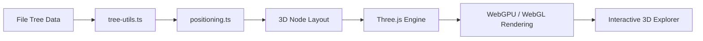

<h1 align="center">3Drive</h1>
<h3 align="center">3D Based Cloud Storage Service</h3>

<p align="center">
  Experience your file system in 3D space — browse, manage, and interact with files in an immersive environment.
</p>

<p align="center">
  <a href="#-key-features">Features</a> •
  <a href="#%EF%B8%8F-architecture">Architecture</a> •
  <a href="#-getting-started">Getting Started</a> •
  <a href="#-tech-stack">Tech Stack</a> •
  <a href="#-migration">Migration</a>
</p>

---

## Key Features

<table>
  <tr>
    <td align="center" width="20%"><b>3D File Explorer</b></td>
    <td align="center" width="20%"><b>Drag & Drop</b></td>
    <td align="center" width="20%"><b>Folder Navigation</b></td>
    <td align="center" width="20%"><b>File Preview</b></td>
    <td align="center" width="20%"><b>Camera Controls</b></td>
  </tr>
  <tr>
    <td align="center"><sub>Browse files and folders rendered as interactive 3D nodes</sub></td>
    <td align="center"><sub>Move files between folders with intuitive drag-and-drop</sub></td>
    <td align="center"><sub>Traverse hierarchical folder structures seamlessly</sub></td>
    <td align="center"><sub>Preview file metadata and contents on click</sub></td>
    <td align="center"><sub>Zoom, pan, and rotate the 3D camera freely</sub></td>
  </tr>
</table>

---

## Architecture

```
src/
├── pages/          # Route pages (HomePage, DrivePage)
├── three/          # Three.js core (no React dependency)
│   ├── engine.ts   # Scene, Camera, Renderer initialization
│   ├── controls.ts # OrbitControls
│   ├── raycaster.ts# Click/hover/drag events
│   ├── lights.ts   # Lighting
│   └── objects/    # 3D objects (file-node, trash-zone, loaders, etc.)
├── stores/         # Zustand stores (modal-store, ui-store)
├── components/     # React UI (layout, modal, search, context-menu, ThreeCanvas)
├── lib/            # Pure utilities (tree-utils, positioning, etc.)
├── hooks/          # Custom hooks
└── types/          # Type definitions
```

**Rendering Pipeline**



**React ↔ Three.js Separation**

```
React (UI Layer)          ThreeCanvas.tsx (Bridge)         Three.js (3D Layer)
├── Zustand Stores   ←→   useEffect init/cleanup    ←→     ├── engine.ts
├── Modal Components                                       ├── raycaster.ts
└── Search/Menu                                            └── objects/
```

---

## Getting Started

**Prerequisites:** Node.js 18+ and [Bun](https://bun.sh/)

```bash
# 1. Clone the repository
git clone https://github.com/your-id/3Drive.git
cd 3Drive

# 2. Install dependencies
bun install

# 3. Start the development server
bun dev

# 4. Open in browser
open http://localhost:5173
```

---

## Tech Stack

| Category             | Technologies                              |
| -------------------- | ----------------------------------------- |
| **Framework**        | Vite, React 19                            |
| **3D Rendering**     | Three.js (WebGPURenderer, WebGL fallback) |
| **State Management** | Zustand                                   |
| **Routing**          | React Router v7                           |
| **Animation**        | GSAP (camera), Framer Motion (UI)         |
| **Styling**          | Tailwind CSS 4                            |
| **Language**         | TypeScript 5                              |

---

## Migration

This project is a ground-up rewrite of the [original 3Drive](../3Drive-mock/) prototype.

### What Changed

| Before                      | After                                    |
| --------------------------- | ---------------------------------------- |
| Next.js 15 (App Router)     | Vite + React 19 SPA                      |
| React Three Fiber           | Native Three.js (WebGPURenderer)         |
| React Context (6 providers) | Zustand (2 stores)                       |
| next/navigation             | React Router v7                          |
| @react-three/drei           | three/addons (OrbitControls, GLTFLoader) |
| @react-three/postprocessing | Three.js TSL node-based postprocessing   |

### Why

- **Performance**: Native Three.js with WebGPU support eliminates R3F abstraction overhead
- **Simplicity**: 6 React Context providers → 2 Zustand stores
- **Separation of Concerns**: Three.js code is pure TS with no React dependency — easier to test and maintain
- **Modern Rendering**: WebGPURenderer with automatic WebGL fallback

### What Was Kept

Core logic that doesn't depend on the rendering framework was reused as-is:

- File tree data structures and traversal (`tree-utils.ts`)
- 3D positioning algorithms (`positioning.ts`)
- File type mappings (`extension.ts`)
- Camera angle presets (`angles.ts`)

> For the full migration plan, see [`docs/migration-plan.md`](docs/migration-plan.md).
